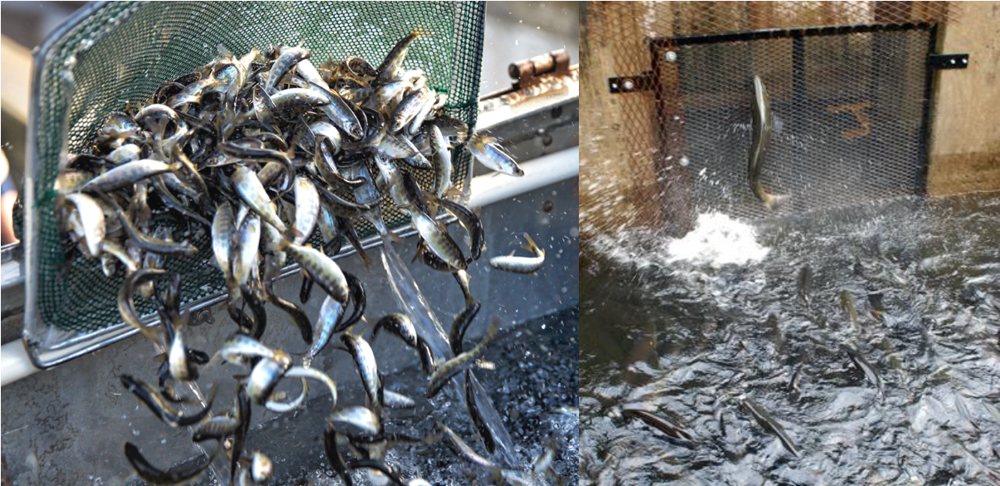

# Domestication selection model

Animals are frequently raised in captivity and released into wild population to increase the productivity of natural resources and conserve the abundance of endangered population. This practice, often called artificial propagation, can be a useful tool for managing natural resources but can also have many unintended consequences. In particular releasing individuals raised in captivity into wild populations can reduce the ability of the wild populations to reduce themselves naturally. A number of factors contribute to these unintended outcomes. 

Captive bread individuals may compete with wild individuals for shared resources or attract predators that can reduce the populations abundance. The introduction of these individuals can also influence the behavior of wild born animals in ways that reduce their fitness. Finally, the captive breading environment can select of traits that are not favorable in the wild. This can reduce the fitness of the wild population if captive bread individuals are allowed to interbreed with the wild population.

All of these effects can be described with mathematical and numerical modeling techniques. This repository contains code to analyze these models numerically, and jupyter notebooks that present the results of some of these model.   
